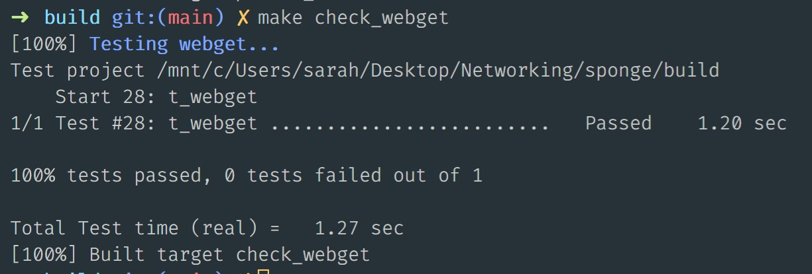

# Lab 0 Writeup

My name: Sara Gahee Han

- Optional: I had unexpected difficulty with: `cmake ..` 을 하고 나니, g++ 버전에 문제가 있었다. g++ 8 을 다운받아서 update-alternative 를 하였는데도 바뀐 버전이 적용이 되지 않았다. CMake 파일이 어떤 버전을 인식하는지 알아보고자 message() 로 버전을 찍어보니 이전의 7.5.0 버전이 나왔다. 터미널을 껐다가 켜봐도 적용이 되지 않았는데, 결국 CMakeCache 파일이 문제라는 것을 알아냈다. Cache 를 삭제하니 바로 빌드가 성공했다.

- Optional: I think you could make this lab better by: [describe]

- Optional: I was surprised by: [describe]

- Optional: I'm not sure about: [describe]

---

### 과제 명세

#### 1. apps 폴더 밑의 webget.cc 에 비어있는 코드 작성하기.

- 힌트

  - HTTP 의 라인은 "\r\n"으로 끝나야 한다.
  - Connection : close 를 요청에 보내는 것을 잊지 말 것.
  - 10줄 정도의 코드면 충분함.

- 컴파일 `make`

  - 에러 메시지가 나오면 코드를 고쳐야함.

- 마감 기한 : 10월 14일 ~ 10월 22일 (cs144 의 과제 기간을 따라서 8일로 설정)

- 테스트 결과 화면
  

#### 2. An in-memory reliable byte stream

- byte_stream.hh 와 byte_stream.cc 파일의 인터페이스를 구현하라.

- 마감 기한 : 10월 15일 ~ 10월 30일 (cs144 의 과제 기간을 따라서 14일로 설정)
